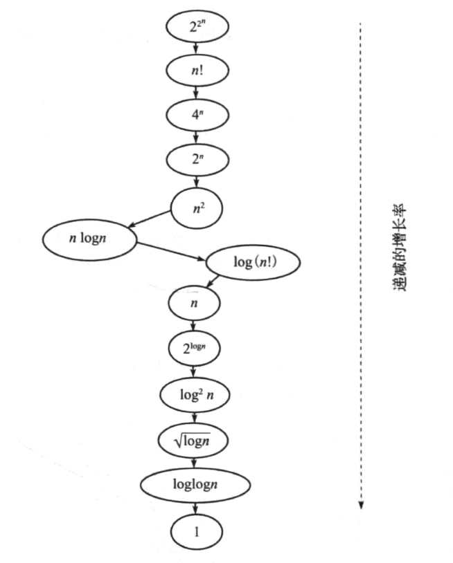

# 数据结构与算法经典问题分析-读书笔记

## 第一章  概念

### 1.1、什么时运行时间分析

当问题的规模增大时，研究其处理时间是如何增加的。

### 1.2、什么是增长率

增长率就是随着输入规模的增加，**算法运行时间增加的速度**，它理输入规模的函数。*（这里关注的是增长的趋势，而不是具体耗时2秒还是2分钟）*

**常用的增长率**

**不同增长率之间的关系**

### 1.3、算法分析类型

**1、最坏情况**

**2、最好情况**

**3、平均情况**

下界 <= 平均时间 <=上界

### 1.4、大O表示法

==【对定义的理解】==

1、大O表示法，告诉我们的是一个程序程序的快慢，而不是它用了几秒或几分钟。也就是说它表示的是快慢的趋势。

2、大O表示法比较的是操作数，它指出了算法运行时间的增速。

3、$\  O(n),O(n^2),O(nlogn) 括号里就是操作数 $

1.5、$\ \Omega $ 表示法

求下界，没意义，不常用

1.6、$\ \Theta $ 表示法

当上界(O)和下界($\ \Omega $)相同时，使用$\ \Theta $ 表示法

